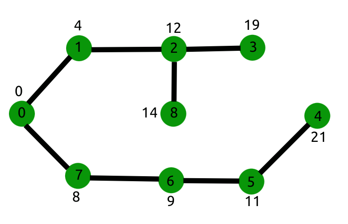

### abdulmukit98.github.io

	git config --global user.name "Your name"
	git config --global uuser.email "Your emaill"
	
	git clone https://github.com/abdulmukit98/abdulmukit98.github.io.git
	git status
	git add --all
	git commit -m "new commit"
	git push -u origin master

### pull

	pull overwrite local file and match to remote repo
	creat a file in remote repo
	pull it to local repo

	in abdulmukit98.github.io folder
	git pull https://github.com/abdulmukit98/abdulmukit98.github.io.git
	or sumply git pull

### force pull
	
	in abdulmukit98.github.io path
	git fetch --all
	git reset --hard origin/master

### syntax 

[lesson](https://www.youtube.com/watch?v=lusCM67ZvNM) 

    highlight.js
    <link rel="stylesheet"
      href="//cdn.jsdelivr.net/gh/highlightjs/cdn-release@10.2.1/build/styles/default.min.css">
    
    
    

### entity
<h3>
https://www.w3schools.com/html/html_entities.asp 
https://www.freeformatter.com/html-entities.html 
</h3>

### iframe embeds
        

            <iframe class="embed-responsive-item" src="https://www.youtube.com/embed/pVfj6mxhdMw"></iframe>
        
 
### responsive image
    

### tool
* imagecolorpicker
